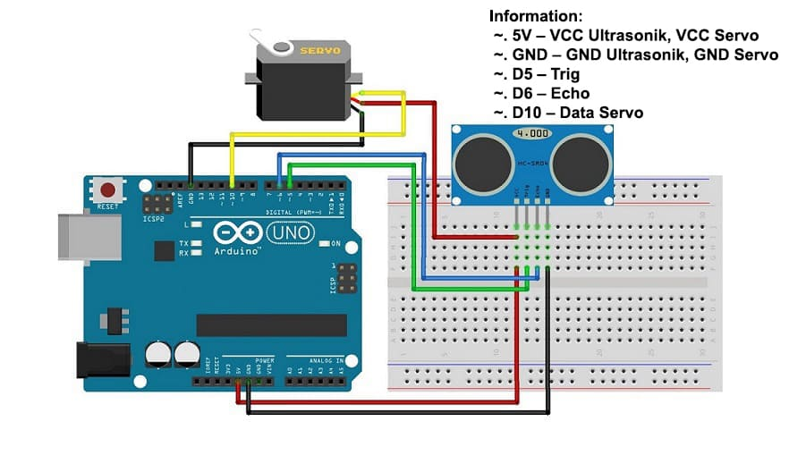

# Automatic Dispenser with Arduino Uno

This project demonstrates how to create an automatic dispenser using an Arduino Uno, an HCSR04 ultrasonic sensor, and a servo motor. The dispenser automatically operates based on the distance detected by the ultrasonic sensor.

## Components Used

- **Arduino IDE or VS Code;**
- **Library HCSR-04 (Sensor Ultrasonik);**
- **Library Servo;**
- **Arduino Uno = 1 piece;**
- **HCSR04 Ultrasonic Sensor = 1 piece;**
- **Servo Motor (SG90) = 1 piece;**
- **Project Breadboard = 1 piece;**
- **Jumper Wires.**

## Schematic Image:

- Below you can see a schematic image to facilitate the wiring of cables from the microcontroller to devices, both input and output sensors:



## How It Works

The HCSR04 ultrasonic sensor is used to measure the distance of an object from the sensor. If the object is within 6 cm of the sensor, the servo motor rotates to 0 degrees to dispense the material. If the object is farther than 6 cm, the servo motor rotates back to 180 degrees.

### Circuit Diagram Information

Connect the components as follows:

- **HCSR04 Sensor**:

  - Trig Pin to Arduino Pin D5
  - Echo Pin to Arduino Pin D6
  - VCC to 5V
  - GND to GND

- **Servo Motor**:
  - Signal Pin to Arduino Pin D10
  - VCC to 5V
  - GND to GND

## Work steps

- Prepare the tools and materials to be used.
- Carry out the wiring process using Figure schematic of the above circuit.
- Open the Arduino IDE software that has been installed on laptop/computer.
- Download all the libraries above and insert the library by opening the Arduino IDE, selecting Sketch > Include Library -> Add.Zip Library.
- Type the sketch program on the Arduino IDE page.
- Enter the I2C LCD address in the sketch program.
- Carry out the process of uploading the program

### Code

The following Arduino code is used to control the automatic dispenser:

```cpp
#include <HCSR04.h>
#include <Servo.h>

HCSR04 hc(5,6); // Initialize HCSR04 with trig pin 5 and echo pin 6
Servo myservo;

int jarak = 0;

void setup() {
  myservo.attach(10);
}

void loop() {
  jarak = hc.dist();
  if(jarak <= 6){
    myservo.write(0);
    delay(200);
  }
  else{
    myservo.write(180);
    delay(1000);
  }
}

```
### How to Upload the Code

1. Open the Arduino IDE.
2. Create a new sketch and copy the provided code into it.
3. Connect your Arduino Uno to your computer using a USB cable.
4. In the Arduino IDE, go to **Tools > Board** and select "Arduino Uno".
5. In the Arduino IDE, go to **Tools > Port** and select the port corresponding to your Arduino Uno.
6. Click on the **Upload** button (right arrow icon) in the Arduino IDE toolbar to upload the code to your Arduino Uno.
7. Once the upload is complete, your project should be ready to run.

<hr/>

## Usage
- Place your hand or an object near the sensor (within 6 cm) to trigger the servo motor, which will then operate the dispenser.

<hr/>

## Conclusion:
- The program works by detecting the sensor distance ultrasonic with objects (glass). If the distance is less than specified then the servo will pull the tap dispenser so that the water will flow automatically.
